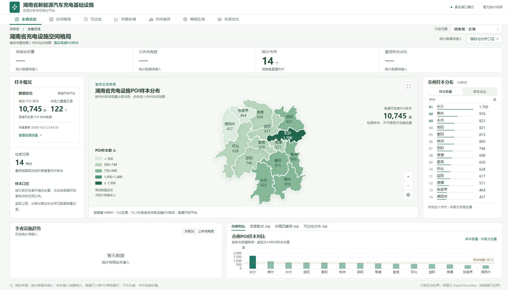
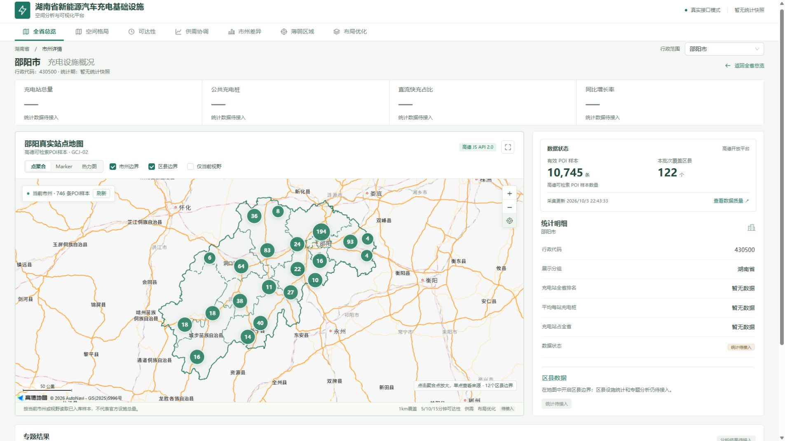
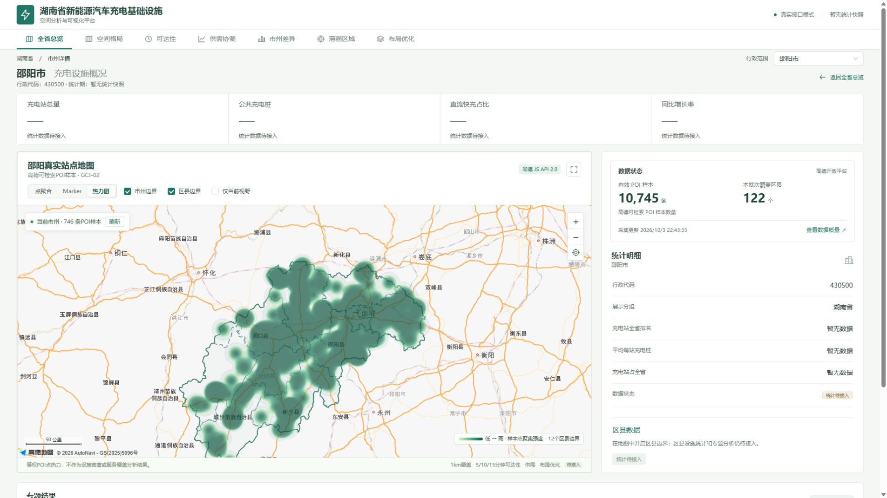

# 两级地图展示层

更新日期：2026-10-04。保留已有Vue3、Pinia、Router、Axios、FastAPI架构和真实站点采集链路；专题布局调整只读取已有接口。

## 省级专题地图

`MapView`在没有`cityCode`时优先使用`SpatialMap`读取持久化分析快照；没有快照时使用`ProvinceMap`读取真实采集汇总。注册已有`src/assets/hunan.geojson.json`真实行政边界，以ECharts Map绘制14市州；省级页面不加载高德道路底图或全省站点Marker。

`src/config/maps.js`从GeoJSON派生行政代码、名称、中心点和边界，统一两个地图渲染器的市州映射。正式快照提供样本数量、POI样本密度、1km直线样本覆盖率三指标以及网格、聚集、覆盖、未覆盖图层；按固定快照和行政区范围读取。后备数量值来自`GET /collection/summary`的`cities[].storedCount`，比例分母为`storedCount`。固定数量分级：小于500、500–749、750–999、1,000–1,499、至少1,500条。它们只用于显示POI样本差异，不代表设施密度或服务能力。

地图区域点击直接进入`/city/:cityCode`。地图Hover、右侧排名Hover/键盘焦点和对比图定位共用Pinia高亮状态。Tooltip给出完整样本单位、比例和口径；密度和1km直线样本覆盖来自真实计算，Hover含质量及完整性警告；道路分钟可达性、供需指数保持待接入。专题点击用于选择范围，总览点击保留市州详情路由。支持缩放、重置、全屏，ResizeObserver跳过零尺寸布局，卸载销毁实例。

## 市州站点地图

有`cityCode`时，`MapView`按需加载`CityMap`和高德JS API 2.0。默认点聚合，可切换Marker和等权POI热力；支持市州边界、区县边界、站点信息窗、缩放、重置与全屏。

`useCityStations`只查询当前市州，区县钻取增加`adcode`；开启“仅当前视野”后增加bbox：

```text
GET /stations?city=430500&page=1&page_size=200&real_only=true
GET /stations?city=430500&adcode=430527&page=1&page_size=200&real_only=true
GET /stations?city=430500&bbox=west,south,east,north&page=1&page_size=200&real_only=true
```

API分页属于传输细节，适配层内部读完当前范围后发布完整结果。移动/缩放450ms防抖，切换市州或查询范围取消旧请求，避免旧响应覆盖当前图层。界面没有列表式分页按钮。请求失败显示重试，不回退模拟站点。站点信息窗保留POI ID、来源、入库时间与GCJ-02坐标，桩数没有可靠数据时保持待接入。

区县边界优先读取持久化`/analysis/boundaries?parent=:cityCode`并按边界哈希缓存；无快照时保留高德JS `DistrictSearch`按当前市州查询边界；串行请求间隔400ms，超时/失败有状态与重试，完整成功结果才缓存。区县选择、排名及边界点击更新`/city/:cityCode?district=:adcode`；越市州编码拒绝且不渲染错误范围。下方专题结果展示区县统计、网格、聚集、覆盖与未覆盖面。网格筛选保留相交的完整省级固定网格，不重算区县局部密度。热力图仅表示等权样本点聚集强度，不表示设施密度、覆盖或可达性结果。

## 数据口径与界面

左侧轻量状态卡读取真实汇总；详细原始量、去重量、排除原因、市州数量、触及返回上限的区县和批次编号进入Drawer。全部数量和更新时间动态读取接口，没有在组件中写死10,745或122。

当前累计有效样本10,745条，最新批次完成122区县。只能称为“高德可检索充电设施POI样本数量”，不代表湖南省官方设施总量或实际营业状态。没有可靠的充电桩、历史趋势或尚未实现的分析数据时保持待接入，未新增模拟业务值。

## 实际验证

- 运行Vite、FastAPI和本地MySQL；专题布局不修改采集链路。正式分析使用独立派生表与读取接口。
- 当前实际省图进入邵阳746条，再选择绥宁23条；返回市州/全省、跨市州区县拒绝、零聚集网格说明均核验。
- 省级地图显示14市州真实边界、名称和样本数，颜色与图例一致；排名样本数量/占比切换正常。
- 排名焦点联动Tooltip：永州823条，占全省样本7.66%；地图Hover采用同一ECharts事件链路。
- 实际点击地图中央区域进入邵阳市`/city/430500`，返回全省恢复专题地图。
- 邵阳完整加载746条真实样本，Marker DOM数量746；聚合、Marker、热力图互相切换正常。
- 长沙详情页完整加载1,700条样本，Marker DOM数量1,700，未停留在首批200条。
- 通过市州选择器从长沙切换湘潭，路由变为`/city/430300`，站点范围替换为571条，Marker DOM数量571。
- 站点信息窗显示“湖南海燕电气公共充电桩”、POI ID、来源、采集时间、GCJ-02坐标；充电桩数保持统计待接入。
- 邵阳12个区县边界成功加载并可与热力图叠加。
- 开启仅当前视野并放大后加载423条样本；关闭恢复746条。
- 省级与市州全屏、缩放、重置已操作检查；1920×1080和1366×768桌面布局正常，底部图表可读。
- 尺寸切换曾触发ECharts零尺寸变换错误，增加尺寸保护后复测全屏退出、桌面尺寸切换、缩放重置没有新增运行错误。
- `npm run build`成功，3859个模块构建完成；保留Ant Design/ECharts共享包大于500kB的体积提示，没有构建错误。
- `npm run format:check`、`git diff --check`通过。`npm run check`也通过，但该脚本检查的是历史fixture，不能用作真实站点数量证明。

检查截图：







## 后续建议

先核验行政边界版本和坐标系，复核POI分类与营业状态，补充可靠的设施统计与区县口径。完成这些数据条件后再接入独立分析结果。已实现1km直线样本覆盖；未实现道路分钟可达性、供需、OR-Tools或AI。公式和模型限制见[空间方法](SPATIAL_METHODS.md)，当前结果和证据见[完成审计](COMPLETION_AUDIT.md)。

## 2026-10-04质量优化补充

上面的746/1700个Marker为前一阶段历史验证，不是当前渲染策略。当前默认聚合；单点Marker限制500条，超过限制时禁用该图层并提示缩小范围。芙蓉区179条Marker已验证选中、聚焦与信息窗。200条分页仅用于API传输，地图没有列表式翻页。当前地图与排名支持数量、密度、1km直线样本覆盖率共用指标；全项目证据见QUALITY_OPTIMIZATION.md。
